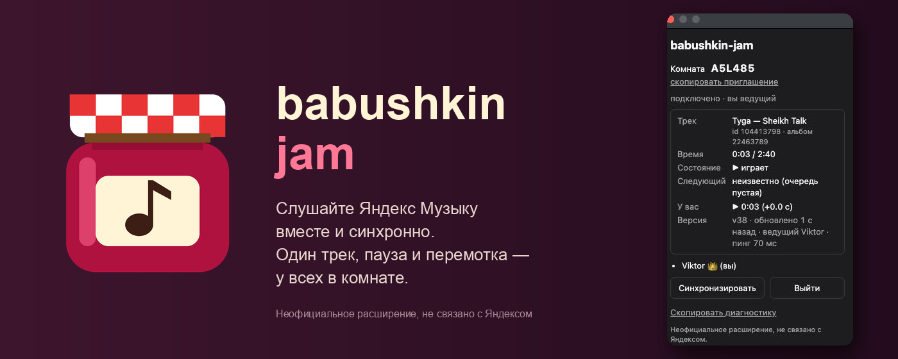
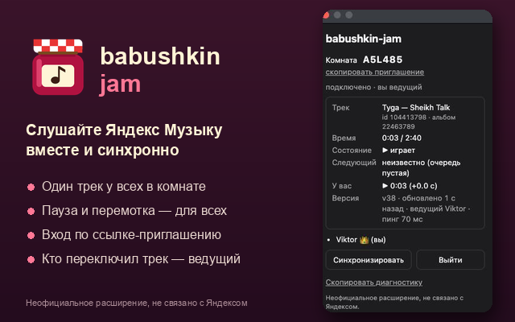

<p align="center">
  
</p>

<h1 align="center">babushkin-jam</h1>

<p align="center">
  Слушайте Яндекс Музыку вместе и синхронно.<br>
  Один трек, пауза и перемотка — у всех в комнате, каждый в своём браузере.
</p>

<p align="center">
  <a href="https://chromewebstore.google.com/detail/babushkin-jam/iincaikpjidieflnaajiehogcimgbepe">Chrome Web Store</a> ·
  <a href="#установка">Установка</a> ·
  <a href="#как-пользоваться">Как пользоваться</a> ·
  <a href="#приватность">Приватность</a> ·
  <a href="#свой-сервер">Свой сервер</a> ·
  <a href="CHANGELOG.md">Изменения</a> ·
  <a href="https://github.com/imbabyboy/babushkin-jam/issues">Сообщить о проблеме</a>
</p>

<p align="center">
  <a href="https://chromewebstore.google.com/detail/babushkin-jam/iincaikpjidieflnaajiehogcimgbepe"></a>
  <a href="https://github.com/imbabyboy/babushkin-jam/releases"></a>
  <a href="https://github.com/imbabyboy/babushkin-jam/actions/workflows/ci.yml"></a>
  <a href="#что-нужно"></a>
  <a href="#свой-сервер"></a>
  <a href="LICENSE"></a>
</p>

<p align="center">
  <a href="https://chromewebstore.google.com/detail/babushkin-jam/iincaikpjidieflnaajiehogcimgbepe"></a>
</p>

<p align="center">
  
</p>

Аналог Spotify Jam для веб-версии Яндекс Музыки. Создайте комнату, отправьте друзьям ссылку — и у всех заиграет один и тот же трек на той же секунде. Без аккаунтов и регистрации: только расширение для Chrome и маленький сервер комнат.

> [!NOTE]
> Это неофициальное расширение. Оно не связано с ООО «Яндекс» и не одобрено им. Каждому участнику нужна своя подписка Яндекс Музыки.

## Что умеет

- **Общий трек.** Кто переключил трек, тот ведущий — у остальных включается то же самое.
- **Общая пауза и перемотка.** Любой участник ставит паузу или перематывает, и это применяется ко всем. Ведущий при этом не меняется.
- **Автопереход.** Трек доиграл — у всех включается следующий трек ведущего.
- **Подстройка рассинхрона.** Расширение сверяет часы с сервером и перематывает, если позиция разошлась больше чем на 2 секунды.
- **Приглашение ссылкой.** `music.yandex.ru/?jam=КОД` открывает панель с кнопкой «Войти в джем».
- **Панель прямо на сайте.** Кнопка «🎧 Джем» в правом нижнем углу: создать комнату, войти по коду, участники, выход. Значок расширения нажимать не нужно.
- **Диагностика.** Попап показывает, что знает сервер, и ваше расхождение с ним, а также копирует отчёт для баг-репорта.

| Действие | Кто может | Что у остальных | Ведущий меняется |
| --- | --- | --- | --- |
| Переключил трек вручную | любой | тот же трек | да, на него |
| Пауза / плей | любой | то же | нет |
| Перемотка | любой | та же позиция | нет |
| Трек доиграл сам | — | следующий трек ведущего | нет |

## Установка

**Из Chrome Web Store** — [babushkin-jam](https://chromewebstore.google.com/detail/babushkin-jam/iincaikpjidieflnaajiehogcimgbepe) → «Установить». Обновления приходят сами.

**Вручную** — если магазин недоступен или нужна конкретная версия:

1. Скачайте `babushkin-jam.zip` со [страницы релизов](https://github.com/imbabyboy/babushkin-jam/releases) и распакуйте.
2. Откройте `chrome://extensions` и включите «Режим разработчика» (справа вверху).
3. «Загрузить распакованное» → выберите распакованную папку.

После установки перезагрузите вкладку music.yandex.ru, если она была открыта. Сервер уже прописан, имя выбирается случайно («Суслик», «Волк»…), так что настраивать ничего не нужно.

## Как пользоваться

**Создать джем.** На music.yandex.ru нажмите «🎧 Джем» → «Создать комнату» → «Скопировать ссылку» и отправьте её друзьям. Включите трек — вы станете ведущим.

**Присоединиться.** Откройте ссылку от друга — панель откроется сама, останется нажать «Войти в джем». Или «🎧 Джем» → ввести код → «Войти».

**Кнопка стала жёлтой?** Chrome не даёт включать звук, пока по вкладке никто не кликнул. Кликните по кнопке.

<p align="center">
  
</p>

## Приватность

Расширение работает только на `music.yandex.*` и просит одно разрешение — `storage`. Пока вы в комнате, на сервер уходят только имя, код комнаты, текущий трек и состояние воспроизведения. Сервер пересылает их участникам той же комнаты и держит только в памяти: без базы данных, журналов и аналитики. Логины, cookies и данные аккаунта Яндекса не читаются и не передаются.

Подробно — в [docs/PRIVACY.md](docs/PRIVACY.md) и [docs/PERMISSIONS.md](docs/PERMISSIONS.md).

## Что нужно

- Chrome 111 или новее (или другой браузер на Chromium)
- Аккаунт и подписка Яндекс Музыки у каждого участника
- Одна открытая вкладка Яндекс Музыки: каждая вкладка входит в комнату отдельным участником

## Свой сервер

Сервер комнат — один файл на Node.js с единственной зависимостью `ws`.

```sh
cd server
npm install
npm start          # ws://localhost:8787
npm run dev        # с перезапуском при изменении кода
```

Чтобы расширение ходило к нему, впишите адрес в поле «Сервер» в попапе. Для постоянного сервера с HTTPS в репозитории есть Docker + Caddy и скрипт деплоя — см. [docs/SELF_HOSTING.md](docs/SELF_HOSTING.md).

### Разработка

Расширение не нужно собирать: Chrome загружает папку `extension/` как есть. После правок нажмите ↻ у расширения в `chrome://extensions` и перезагрузите вкладку. Архив для релиза:

```sh
cd extension && zip -r ../dist/babushkin-jam.zip . -x '.*'
```

В VS Code: `Cmd+Shift+B` запускает сервер в режиме watch, остальное — в «Tasks: Run Task». Устройство проекта и договорённости — в [CONTRIBUTING.md](CONTRIBUTING.md).

## Если что-то не работает

Типовые проблемы и как их проверить — в [docs/TROUBLESHOOTING.md](docs/TROUBLESHOOTING.md). Если не помогло — [откройте issue](https://github.com/imbabyboy/babushkin-jam/issues/new/choose) и приложите отчёт из попапа («Скопировать диагностику»).

## Документация

- [Приватность](docs/PRIVACY.md) — какие данные уходят на сервер и какие нет
- [Разрешения](docs/PERMISSIONS.md) — зачем расширению каждое разрешение
- [Свой сервер](docs/SELF_HOSTING.md) — запуск и деплой сервера комнат
- [Решение проблем](docs/TROUBLESHOOTING.md) — частые неполадки и отладка
- [Участие в разработке](CONTRIBUTING.md) — устройство проекта и соглашения
- [Поддержка](SUPPORT.md) — куда писать
- [Безопасность](SECURITY.md) — как сообщить об уязвимости
- [Контекст проекта](docs/project-context.md) — с чего всё начиналось

## Ограничения

- Официального API у Яндекс Музыки нет. Адаптер плеера (`extension/src/page.js`) опирается на устройство сайта и может сломаться после его обновления.
- Очередь ведущего целиком не читается: известен только следующий трек.
- Если трека нет в подписке или регионе участника, у него синхронизация не сработает.

## Лицензия

[MIT](LICENSE). «Яндекс» и «Яндекс Музыка» — товарные знаки ООО «Яндекс»; проект использует их только чтобы указать, с каким сервисом работает расширение.
